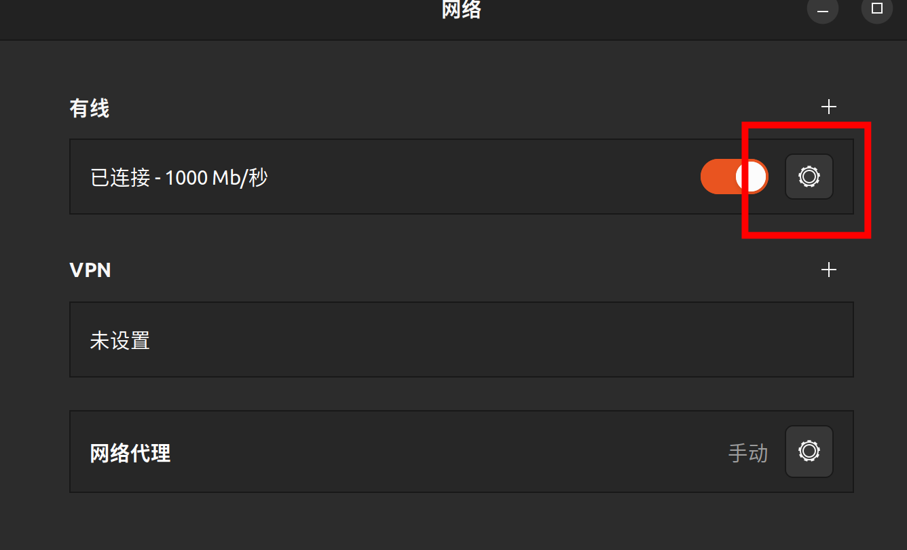
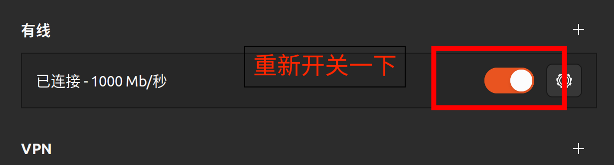

# RL_AIHandkerchief

一个基于 ROS 2 Humble 的 Piper 机器人强化学习实机部署项目。

## 项目概述

本项目包含 Piper 机器人的 ROS 2 包，支持仿真、描述文件、消息定义和 MoveIt 配置。项目基于---

**项目链接:** https://github.com/Nangongyeee/RL_AIHandkerchief


## 克隆本项目

```bash
git clone https://github.com/Nangongyeee/RL_AIHandkerchief.git
```

## Vicon Bridge 配置和使用

### 安装依赖

1. **安装 CycloneDDS**:
```bash
cd ~
git clone https://github.com/eclipse-cyclonedds/cyclonedds.git
cd cyclonedds
mkdir build && cd build
cmake ..
make -j
sudo make install
cd ~/RL_AIHandkerchief
```

2. **安装 CycloneDDS-CXX**:
```bash
cd ~
git clone https://github.com/eclipse-cyclonedds/cyclonedds-cxx.git
cd cyclonedds-cxx
mkdir build && cd build
cmake ..
make -j
sudo make install
cd ~/RL_AIHandkerchief
```

## piper_sdk相关包

参考https://github.com/agilexrobotics/piper_ros.git的humble分支配置环境

## piper_rl_deploy配置

参考https://github.com/fan-ziqi/rl_sar.git配置环境

### 使用说明

1. **准备模型文件**：将你训练好的 PyTorch (.pt) 或 ONNX (.onnx) 模型放入 `src/piper_rl_deploy/models/` 目录。

2. **配置参数**：编辑 `src/piper_rl_deploy/config/piper_rl_config.yaml`，设置 `model_path`、`model_type`、`obs_dim`、`action_dim`、`joint_names` 等参数，确保与实际模型和机器人配置一致。

3. **构建包**：
```bash
colcon build --packages-select piper_rl_deploy
```
1. **修改话题名称**：根据需要修改 `src/piper_rl_deploy/config/piper_rl_config.yaml`中的话题名称。

2. **启动部署**：
```bash
ros2 launch piper_rl_deploy piper_rl_deploy.launch.py
```

1. **高级用法**：
```bash
可通过 `model_path`、`model_type`、`config_file` 等参数自定义模型和配置文件：
```bash
ros2 launch piper_rl_deploy piper_rl_deploy.launch.py \
	model_path:=models/your_model.pt \
	model_type:=pytorch
```

更多详细功能和接口说明请参考 `src/piper_rl_deploy/README.md`。

## 环境要求

- Ubuntu 22.04 LTS
- ROS 2 Humble
- Python 3.10
- Conda/Miniconda
- Isaac Lab 环境

## 快速开始

### 手动配置

```bash
source /opt/ros/humble/setup.bash && colcon build --symlink-install
source install/setup.bash
```

## 包说明

- **piper_msgs**: 自定义消息定义
- **piper_description**: 机器人模型描述 (URDF/Xacro)
- **piper_gazebo/piper_mujoco**: 仿真配置
- **piper_*_moveit**: MoveIt 运动规划配置
- **piper_rl_deploy**: 强化学习部署配置
- **vicon_bridge**: Vicon 数据桥接
- **vicon_msgs**: Vicon 消息定义


## 基本使用

**重要：保证你的电脑和Vicon主机、Vicon相机系统在同一局域网下**





**重要：每次使用前必须先设置环境**

```bash

# 2. 设置 ROS 2 环境（根据你的 shell 选择）
source /opt/ros/humble/setup.bash  # bash 用户
source /opt/ros/humble/setup.zsh   # zsh 用户

# 3. 设置项目环境
source install/setup.bash  # bash 用户
source install/setup.zsh   # zsh 用户

# 启动单个 Piper（需要硬件连接）
ros2 launch piper start_single_piper.launch.py

# 测试机械臂连接是否正常
python test_mit_detailed.py

# 测试 Vicon 数据桥接
export VICON_IP=192.168.10.1
ros2 launch vicon_bridge2 vicon.launch.py

# 启动RL部署程序
ros2 launch piper_rl_deploy piper_rl_deploy.launch.py

```

### Piper RL Safe Deploy 使用说明

```bash
# 1. 激活 CAN 接口
cd /home/gift/piper_sdk/piper_sdk
bash can_activate.sh can0 1000000

# 2. 初始化位置
python piper_ctrl_joint.py

# 3. 测试 Vicon 数据桥接
export VICON_IP=192.168.10.1
ros2 launch vicon_bridge2 vicon.launch.py

# 4. 链接 Piper（需要硬件连接）
ros2 launch piper start_single_piper.launch.py

# 5. 启动坐标测试
ros2 launch piper_rl_deploy coordinate_test.launch.py

# 6. 启动RL部署程序
export LD_LIBRARY_PATH="/home/gift/libtorch/lib:$LD_LIBRARY_PATH" && ros2 launch piper_rl_deploy piper_rl_safe_deploy.launch.py

```

---

### 常见问题

- **错误1：`KeyError: 'VICON_IP'`**
- 原因: 缺少 VICON_IP 环境变量
- 解决: 设置 `export VICON_IP=你的Vicon系统IP` Isaac Lab 环境。

- **错误2：`libtorch`**
- 原因: CMake在编译时找到了 libtorch 中的PyTorch库，但运行时系统的 LD_LIBRARY_PATH 中没有包含 lib，所以可执行文件找不到 libtorch_cpu.so 和 libtorch.so
- 解决: 设置 `export LD_LIBRARY_PATH=/path/to/libtorch/lib:$LD_LIBRARY_PATH`，将 `/path/to/libtorch/lib` 替换为你的 libtorch 库路径。

**项目链接:** https://github.com/Nangongyeee/RL_AIHandkerchief


